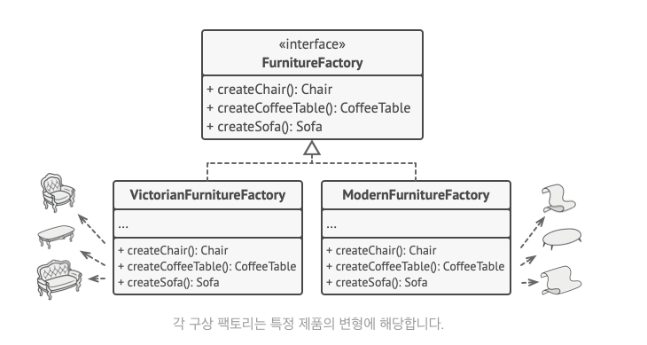
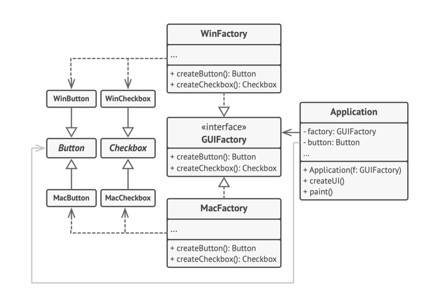

## 추상 팩토리 패턴
- 관련 객체들의 구상 클래스들을 지정하지 않고도 관련 객체들의 모음을 생성하는 패턴
- 기존 객체 모음에서 비슷한 유형끼리 묶어두었을 때, 새로운 객체를 추가하게 되면 같은 유형에 속하도록 객체 생성이 필요할 때 사용
- 각 유형에 해당하는 개별적인 인터페이스를 명시적으로 선언
  - **모든 의자 유형들은 Chair 의 인터페이스를 구현한다** 등의 규칙을 명시
  - 같은 유형의 클래스 내의 모든 생성 메서드들이 목록화 되어 있는 인터페이스
  - createChair, createSofa, createCoffeeTable 등

- 클라이언트는 개별 구현된 팩토리 클래스들의 타입을 알필요가 없도록 구현 필요, 추상 타입(Chair) 인터페이스를 사용하여 항상 동일한 방식으로 사용해야 함

## 구조

### 추상 제품(Abstract Product)
- 같은 유형을 구성하는 개별 연관 제품들의 집압에 대한 인터페이스들을 선언
- 각기 다른 스타일을 가진 의자를 구현하게 될 때, 의자 제품에 대한 인터페이스를 의미

### 구상 제품들(Concrete Product)
- 변형들로 그룹화된 추상 제품들의 다양한 구현들
- 의자를 각기 다른 스타일(모던, 빈티지 등)로 구현하게 될 때 그룹 기준이 되는 클래스

### 추상 팩토리(Abstract Factory)
- 인터페이스는 각각의 추상 제품들을 생성하기 위한 여러 메서드들의 집합을 선언
- createProductChair(), createProductTable() 등의 생성 메서드를 선언

### 구상 팩토리(Concrete Factory)
- 추상 팩토리의 생성 메서드들을 구현하는 구현체
- 각 구상 팩토리는 제품들의 특정 변형들에 해당하며 해당 특정 변형들만 생성

## 예시
- 크로스 플랫폼 사용자 인터페이스 요소들 생성
  - 요소들은 윈도우, 맥, 리눅스 등 선택된 운영 체제에 맞게 생성
  - 추상 팩토리 인터페이스는 일련의 생성 메서드들을 선언하고, 클라이언트 코드가 다양한 유형들의 UI 요소들을 생성하는 데 사용
  
  - GUI 팩토리를 각각의 추상 팩토리가 상속 받아 각 운영체제에 맞는 버튼을 생성하도록 유도
  - 클라이언트 코드에서 운영 체제의 유형 확인 -> 운영체제와 일치하는 클래스에서 팩토리 객체를 생성 (**클라이언트 코드는 UI 요소들의 구상 클래스들에 의존하지 않음**)

## 적용 시점
- **제품군의 다양한 유형과 작동해야 하지만, 구상 클래스들에 의존하고 싶지 않을 때 사용**
  - 미리 유형이 정해져있지 않은 제품들에 대해 향후 확장성이 좋음
  - 잘못된 제품 유형을 생성하지 않음
- **팩토리 메서드들의 집합의 기본 책임이 뚜렷하지 않을 때 구현**
  - 클래스가 여러 제품 유형을 상대할 경우(**단일 책임 원칙 위반**), 클래스의 팩토리 메서드들을 추상 팩토리 구현으로 추출할 수 있음

## 구현 방법
1. 고유한 제품 유형들(버튼, 의자 등) 과 변형될 제품들을 나열
2. 제품 변형들에 대한 추상 인터페이스 선언 -> 모든 구상 제품 클래스들이 이 인터페이스들을 구현하도록 유도
3. 추상 팩토리 인터페이스를 모든 추상 제품들에 대한 생성 메서드들의 집합과 함께 선언
4. 각 제품 변형에 대해 각각 하나의 구상 팩토리 클래스 집합을 구현 (운영체제별 UI 요소 집합, 스타일별 가구 요소 집합)
5. 애플리케이션에서 팩토리 초기화 코드 생성, 초기화 코드는 설정 또는 현재 환경에 따라 구상 팩토리 클래스 중 하나를 인스턴스화해야 함
6. 코드에서 제품 생성자에 대한 모든 호출을 팩토리 객체에 대한 적절한 생성 메서드 호출로 교체

## 장점
- 팩토리에서 생성되는 제품들의 상호 호환성을 보장
- 구상 제품들과 클라이언트 코드 사이의 단단한 결합 회피
- 단일 책임 원칙 유지(**제품 생성 코드를 한곳으로 추출, 유지보수 용이**)
- 개방/폐쇄 원칙 유지(**기존 클라이언트 코드를 훼손하지 않고 새로운 제품 변형들 추가**)

## 단점
- 패턴과 함께 새로운 인터페이스들과 클래스들이 많이 도입, 코드가 필요 이상으로 복잡해질 수 있음