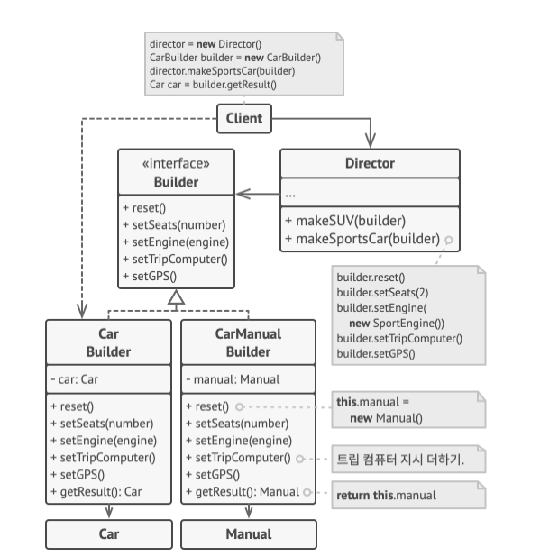

## 빌더 패턴
- 복잡한 객체들을 단계별로 생성할 수 있도록 하는 패턴
- 하나의 클래스가 많은 필드와 중첩된 객체들을 포함할 때 해당 클래스를 생성하기 위해서 너무 긴 생성자를 추가 해야하는 문제점을 해결하기 위함
  - 긴 생성자가 갖는 문제점은 모든 매개변수가 항상 필요하지 않아 null 이나 "" 값을 포함하게 됨
- 또한 새로운 자식클래스가 추가될 때마다 계층구조가 더욱 복잡해짐
- 빌더 패턴은 자신의 클래스에서 객체 생성 코드를 추출하여 `builders` 라는 별도의 객체들로 이동하도록 제안

### 디렉터(관리자)
- 클래스를 생성하는 데 사용하는 빌더 단계들에 대한 일련의 호출을 별도로 추출하는 클래스
- 생성 단계를 실행하는 순서를 정의하지만, 빌더 패턴 구현에서 **필수사항은 아님**
- 다양한 생성 루틴들을 배치하여 프로그램 전체에서 재사용할 수 있는 클래스
- 클라이언트 코드에서 클래스 생성의 세부 정보를 완전히 숨김
- 클라이언트는 빌더를 디렉터와 연관시키고, 디렉터와 생성을 시행한 후 빌더로부터 결과를 얻기만 하면 됨

### 구조
1. **빌더** : 인터페이스는 모든 유형의 빌더들에 공통적인 제품 생성 단계들을 선언
2. **구상 빌더** : 생성 단계들의 다양한 구현을 제공, 구상 빌더들은 공통 인터페이스를 따르지 않는 제품들도 생산 가능
3. **제품들** : 결과로 나온 객체들, 다른 빌더들에 의해 생성된 제품들은 같은 클래스 계층구조 또는 인터페이스에 속할 필요가 있음
4. **디렉터** : 클래스는 생성 단계들을 호출하는 순서를 정의, 제품들의 특정 설정을 만들고 재사용 가능
5. **클라이언트** : 빌더 객체들 중 하나를 디렉터와 연결해야 함,

> 자동차 제품을 생성할 때, 다양한 유형의 제품들을 동일한 객체 생성 코드를 재사용하고 그에 해당하는 메뉴얼을 만드는 표
- Car 클래스를 부풀리는 대신, 자동차 조립 코드를 별도의 자동차 빌더 클래스로 추출하고, 클라이언트 코드는 미세하게 조정되는 특별한 자동차 모델을 조립해야 하는 경우 빌더를 직접 사용
- 또는 조립을 디렉터 클래스로 위임하여 가장 인기있는 자동차 모델들을 조립하는 방법을 제공함

### 적용 시기
- 점층적 생성자를 제거하고 싶을때 사용, Java 에서 메서드 오버로딩을 통해 생성자를 여러개를 만드는 경우 불편함을 해소하기 위해 빌더 패턴 사용
- 일부 제품의 다른 표현들을 생성할 수 있도록 하고 싶을 때 사용, 제품 생성 과정 중 세부 사항만 다른 유사한 단계를 포함할 때 적용 가능
- 복잡한 객체 생성을 제품별로 단계별 생성 가능, 재귀적으로 단계 호출도 가능하여 객체 트리를 구축해야 할 때 매우 유용

### 구현 방법
> 3 ~ 4 번에서 디렉터 활용은 선택사항
1. 사용할 수 있는 모든 제품 표현을 생성하기 위한 공통 생성 단계들을 명확히 정의 (**명확한 정의가 없다면 패턴 구현 진행 불가**)
   - 기초 빌더 인터페이스에서 생성 단계들 정의
2. 각 제품 별 빌더 인퍼테이스 구현하여 생성 결과를 가져오는 메서드를 구현
   - 빌더 인터페이스에서 해당 메서드를 구현하지 않는 이유는 다양한 빌더들이 공통 인터페이스가 없는 제품들을 생성할 수 있기 때문
3. 디렉터 클래스를 생성
4. 클라이언트 코드에서 빌더 객체들과 디렉터 객체들을 모두 생성, 클라이언트 코드에서 빌더 객체를 디렉터에게 전달하여 디렉터 클래스 생성자의 매개변수들을 통해 한번만 전달
5. 모든 제품이 같은 인터페이스를 따르는 경우에만 디렉터로부터 직접 생성 결과를 얻음, 미세한 조정은 클라이언트가 빌더를 통해서 직접 제품을 생성해야 함

### 장점
- 객체들을 단계별로 생성하거나 생성 단계들을 연기하거나 재귀적으로 단계들을 실행할 수 있음
- 제품들의 다양한 표현을 만들 때 같은 생성 코드를 재사용 할 수 있음
- 단일 책임 원칙, 제품의 비즈니스 로직에서 복잡한 생성 코드를 고립 시킬 수 있음

### 단점
- 패턴이 여러 개의 새 클래스들을 생성햐애 하므로 코드의 전반적인 복잡성이 증가

