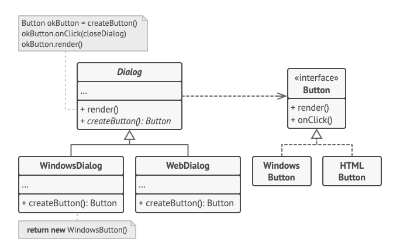

## 팩토리 메서드 패턴(Factory Method)
- 부모 클래스에서 객체들을 생성할 수 있는 인터페이스를 제공, 자식 클래스들이 생성될 객체들의 유형을 변경할 수 있도록 하는 패턴
- 객체 생성을 new 연산자를 사용한 직접 호출들을 특별한 팩토리 메서드에 대한 호출들로 대체하라고 제안
- 팩토리 메서드 내에서 객체들은 new 연산자를 통해 생성, 반환된 객체는 종종 `제품` 으로 불림
- 팩토리 메서드를 사용하는 코드를 종종 클라이언트 코드라고 부름, 클라이언트 코드는 다양한 자식 클래스들에서 실제로 반환되는 여러 제품 간의 차이를 알지 못함
- 클라이언트에게 제품들이 어떻게 작동하는지 숨겨야 함

## 구조

### 제품(Product)
1. 인터페이스 선언, 제품의 기초가 되는 인터페이스
2. 생성자와 자식 클래스들이 생성할 수 있는 모든 객체에 공통

### 구상 제품들(Concrete Product)
1. 제품 인터페이스의 다양한 구현들
2. 제품의 추상 메서드를 상속 받아 실제로 반환되는 객체 

### 크리에이터
1. 구상 제품들을 반환하는 팩토리 메서드를 선언, **팩토리 메서드의 반환 타입은 제품 인터페이스와 일치해야 함**
2. 팩토리 메서드를 abstract 로 선언해서 모든 자식 클래스들이 구현하도록 강제할 수도 있고, 기초 팩토리 메서드가 디폴트 제품 타입을 반환하도록 만들 수 있음
3. 크리에이터 클래스는 제품과 관련된 핵심 비즈니스 로직이 있으며, **팩토리 메서드는 이 로직을 구상 제품 클래스들로부터 디커플링 하는데 도움을 주는 역할임**

### 크리에이터 구현체들
1. 기초 팩토리 메서드를 오버라이드하여 다른 유형의 제품을 반환함
2. 항상 새로운 인스턴스를 생성해야 할 필요는 없음, 기존 객체들을 캐시, 객체 풀 또는 다른 소스로부터 반환 가능

### 예시

- Dialog 클래스는 여러 UI 요소들을 사용하여 대화 상자를 렌더링, 다양한 운영체제에서 요소들은 약간씩 다르게 보일 수도 있지만 일관되게 작동해야 함
- 팩토리 메서드가 적용되면 대화 상자 로직을 각 운영 체제를 위해 반복해서 작성할 필요가 없음
- 자식 클래스에서 팩토리 메소드를 오버라이딩해서 사용, Dialog의 코드 대부분을 상속받아 다른 유형의 버튼들도 렌더링 가능함
> Dialog 클래스에 새로운 팩토리 메서드를 추가할 때마다 추상 팩토리 패턴에 가까워짐

## 적용 시기
- **함꼐 작동해야 하는 객체들의 정확한 유형들과 의존관계들을 미리 모르는 경우에 사용**
  - 제품 생성 코드를 실제로 사용하는 코드와 분리하여 제품 생성 코드를 나머지 코드와 독립, 확장성이 용이해짐
- **라이브러리 또는 프레임워크의 사용자들에게 내부 컴포넌트들을 확장하는 방법을 제공하고 싶을 때 사용**
  - 프레임워크 전체에서 컴포넌트들을 생성하는 코드를 단일 팩토리 메서드로 줄인 후, 누구나 이 팩토리 메서드를 오버라이드 할 수 있게 구현
- **기존 객체들을 매번 재구축하는 대신 재사용하여 시스템 리소스를 절약하고 싶을 때 사용**
  - 데이터베이스 연결, 파일 시스템 및 네트워크처럼 시스템 자원을 많이 사용하는 대규모 객체들을 처리할 때 자주 발생

## 구현 방법
1. 모든 제품이 같은 인터페이스를 상속받도록 함, 이 인터페이스는 모든 제품에서 의미가 있는 메서드들을 선언해야 함
2. 크리에이터 클래스 내부에 빈 팩토리 메서드 추가, 반환 유형은 공통 제품 인터페이스와 일치해야 함
3. 크리에이터 코드에서 제품 생성자들에 대한 모든 참조를 찾아 하나씩 팩토리 메소드에 대한 호출로 교체하여 제품 생성 코드를 팩토리 메서드로 추출 (반환된 제품의 유형을 제어하기 위해 팩토리 메서드에 임시 매개변수를 추출해야 할 수도 있음)
4. 팩토리 메서드에 나열된 각 제품 유형에 대한 크리에이터 자식 클래스들의 집합을 생성, 자식 클래스들에서 팩토리 메서드를 오버라이딩하여 기초 메서드에서 생성자 코드의 적절한 부분들을 추출
5. 제품 유형이 너무 많은 경우, 자식 클래스들의 기초 클래스의 제어 매개변수를 재사용할 수 있음
6. 크리에이터의 팩토리 메서드가 비어있으면 추상화 가능, 비어있지 않으면 그 메서드의 디폴트 행동으로 만들 수 있음

## 장점
1. 크리에이터와 구상 제품들이 단단하게 결합되지 않도록 구현 가능 
2. 단일 책임 원칙 구현 (제품 생성 코드를 프로그램의 한 위치로 이동하여 코드를 더 쉽게 유지관리 가능)
3. 개방/폐쇄 원칙 (기존 클라이언트 코드를 수정하지 않고 새로운 유형의 제품들을 추가 가능)

## 단점
1. 패턴을 구현하기 위해 많은 새로운 자식 클래스들을 도입해야 하므로 코드가 복잡해질 수 있음 
> 가장 좋은 방법은 크리에이터 클래스들의 기존 계층구조에 패턴을 도입하는 것    