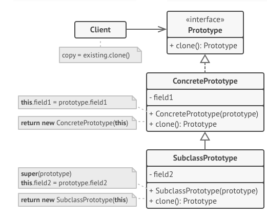

## 프로토타입(Prototype) 패턴
- 코드를 클래스들에 의존시키지 않고 기존 객체들을 복사할 수 있도록 하는 디자인 패턴
- 원본 객체의 모든 필드를 복사하는 것의 문제점
  - 항상 가능하지 않음(private 멤버때문)
  - 직접 접근 시 해당 클래스에 의존하게 됨
  - 일부 인터페이스를 따르는 객체들은 인터페이스만 알고 구상 클래스는 알지 못함
- 포로토타입 패턴은 복제 프로세스를 위임받음, 복제를 지원하는 모든 객체에 대한 공통 인터페이스를 선언
  - 객체의 클래스에 결합하지 않고 해당 객체 복제 가능

## 구조

### 프로토타입 인터페이스
- 복제 메서드들 선언, 이 메서드들의 대부분은 단일 clone 메서드

### 구상 프로토타입
- 복제 메서드를 구현 
- 복제 프로세스와 관련된 일부 예외적인 경우들도 처리(연결된 객체 풀기, 재귀 종속성 풀기 등)

### 클라이언트
- 프로토타입 인터페이스를 따르는 모든 객체의 복사본 생성

### 프로토타입 레지스트리 (선택 구현)
- 자주 사용하는 프로토타입들에 쉽게 접근하는 방법을 제공
- 레지스트리는 복사될 준비가 된 미리 만들어진 객체들의 집합을 저장

## 적용 시기
- 복사해야 하는 객체들의 구상 클래스들에 코드가 의존하면 안될 때 사용
  - 코드가 어떤 인터페이스를 통해 타사 코드에서 전달된 객체들과 함께 작동할 때 많이 발생, 객체들의 구상 클래스들은 알려지지 않았기 때문에 의존할 수 없음
  - 프로토타입 인터페이스를 통해 복제하는 객체들의 구상 클래스들에서 클라이언트 코드를 독립시킴
- 각자의 객체를 초기화하는 방식만 다른 자식 클래스들의 수를 줄이고 싶을 때 사용
  - 많은 설정이 필요한 복잡한 클래스가 있을 때, 공통 설정 코드를 분리하고 이를 프로토타입 패턴으로 사용할 수 있도록 함
  - 일부 설정과 일치하는 자식 클래스를 인스턴스화 하는 대신 클라이언트는 간단하게 적절한 프로토타입을 찾아 복제할 수 있음

## 구현방법
1. 프로토타입 인터페이스 생성 후 clone 메서드 선언, 기존 계층 구조가 있는 경우, 이 메서드를 그 계층 구조의 모든 클래스들에 추가
2. 프로토타입 클래스는 이 클래스의 객체를 인수도 받아들이는 대체 생성자(`new`)를 반드시 정의
   - 생성자는 이 클래스에 정의된 모든 필드의 값들을 전달된 객체에서 새로 생성된 인스턴스로 복사
   - 자식 클래스를 변경할 때에는 부모 생성자를 호출하여 부모 클래스가 부모 클래스의 비공개 필드들의 복제를 처리하도록 해야 함
   - 객체의 데이터를 복제본에 복사하는 작업은 clone 메서드 내에서 수행
   - `new` 생성자에서 clone 메서드를 수행하는 이유는 `new` 연산자를 호출한 후 생성된 객체는 완전히 설정된 상태로 반환되기 때문
3. 복제 메서드는 일반적으로 한 줄로 구성, 생성자의 프로토타입 버전으로 `new` 연산자 실행
   - 모든 클래스는 복제 메서드를 명시적으로 오버라이딩한 후 new 연산자와 함께 자체 클래스 이름을 사용해야 함 (**복제 메서드가 부모 클래스의 객체를 생성 할 수 있기 때문**)
4. (**선택 구현**) 프로토타입들의 카탈로그를 저장할 중앙 프로토타입 레지스트리 생성
   - 레지스트리를 새 팩토리 클래스로 구현하거나 기초 프로토타입 클래스에 프로토타입을 가져오기 위한 정적 메서드와 함께 구성
   - 정적메서드는 클라이언트 코드가 메서드에 전달하는 검색 기준을 기반으로 프로토타입을 검색해야 함(**검색 기준은 단순한 문자열 태그 or 복잡한 검색 매개변수들의 집합**)
   - 자식 클래스들의 생성자들에 대한 직접 호출들을 프로토타입 레지스트리의 팩토리 메서드에 대한 호출들로 대체

## 장점
- 객체들을 구상 클래스들에 결합하지 않고 복제 가능
- 반복되는 초기화 코드 제거, 미리 만들어진 프로토타입들로 복제하는 방법 사용 가능
- 복잡한 객체들을 쉽게 생성 가능 (사전 설정을 처리할 때 상속 대신 사용할 수 있음)

## 단점 
- 순환 참조가 있는 복잡한 객체들을 복제하는 것이 매우 까다로움
