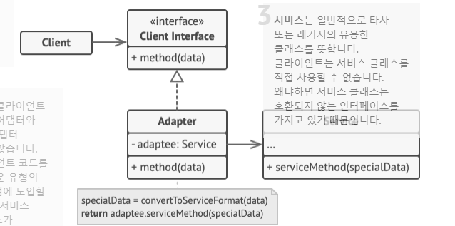

## 어댑터 패턴
- 호환되지 않는 인터페이스를 가진 객체들이 협업할 수 있도록 하는 구조적 패턴
- 다른 라이브러리를 통합할 때 서로 주고받는 데이터가 다른 경우(XML != JSON), 라이브러리를 그대로 사용할 수가 없음
  - 라이브러리를 원하는 형식으로 변경할 수 있으나, 라이브러리에 의존하는 일부 코드가 손상될 수 있음
  - XML -> JSON 형태로 변경하는 작업을 진행, 이때 어댑터는 변환의 복잡성을 숨기기 위하여 객체 중 하나를 래핑하여 데이터 형식을 변환

## 구조

### 객체 어댑터
- 객체 합성 원칙을 사용, 어댑터는 한 객체의 인터페이스를 구현하고 다른 객체는 래핑

- **Adapter** 클래스가 Service의 serviceMethod를 래핑하여 Client Interface 가 사용하도록 함
- 클라이언트 코드는 어댑터와 결합되지 않음 (기존 클라이언트 코드를 손상하지 않고, 새로운 유형의 어댑터들을 프로그램에 도입 가능)

### 클래스 어댑터
- 상속을 사용하여 어댑터는 동시에 두 객체의 인터페이스를 상속, C++ 같이 다중 상속을 지원하는 프로그래밍 언어에서만 구현 가능

## 적용 시점
- 기존 클래스를 사용하고 싶지만 그 인터페이스가 나머지 코드와 호환되지 않을 때 사용
  - 코드와 레거시 클래스, 타사 클래스 또는 특이한 인터페이스가 있는 다른 클래스 간의 변환기 역할
- 부모 클래스에 추가할 수 없는 어떤 공통 기능들이 없는 여러 기존 자식 클래스들을 재사용하려는 경우에 사용
  - 각 자식 클래스를 확장한 후, 누락된 기능을 새로운 자식 클래스에 넣게 되면 해당 코드를 모든 새 클래스들에 복제해야 하며, 중복이 많아짐
  - 누락된 기능을 어댑터 클래스에 넣고, 어댑터 내부에 누락된 기능이 있는 객체들을 래핑하면 필요한 기능들을 동적으로 얻을 수 있음
  - 대상 클래스드른 반드시 공통 인터페이스가 있어야 하며, 어댑터의 필드는 해당 인터페이스를 따라야 함 (**데코레이터 패턴과 매우 유사**)
 

## 구현 방법
1. 호한되지 않은 인터페이스가 있는 클래스가 최소 2개 이상인지 확인
   - 변경할 수 없는 유용한 서비스(`타사 코드, 레거시 코드, 기존 의존성이 많은 코드 등`) 클래스가 있는 경우
2. 클라이언트 인터페이스 선언, 클라이언트들이 서비스와 통신하는 방법 기술
3. 어댑터 클래스를 생성한 수 클라이언트 인터페이스를 따르게 함(처음엔 빈메서드로 따르게 함)
4. 서비스 객체에 참조를 저장하기 위해 어댑터 클래스에 필드 추가 
   - 일반적으론 생성자를 통해 필드를 초기화
   - 때론 어댑터의 메서드들을 호출할 때는 이 필드를 어댑터에 전달하는 것이 편리하기도 함
5. 클라이언트 인터페이스의 모든 메서드를 어댑터 클래스에서 하나씩 구현
   - 어댑터는 인터페이스 또는 데이터 형식 변환만 처리해야 하며, 실제 작업의 대부분을 서비스 객체에 위임해야 함
6. 클라이언트들은 클라이언트 인터페이스를 통해 어댑터를 사용
   - 수정 시 클라이언트 코드에 영향을 주지 않고 어댑터들을 변경하거나 확장할 수 있음

## 장점
- **단일 책임 원칙.** 프로그램의 기본 비즈니스 로직에서 인터페이스 또는 데이터 변환 코드를 분리 가능
- **개방/폐쇄 원칙.** 클라이언트 코드가 클라이언트 인터페이스를 통해 어댑터와 작동하는 한 기존의 클라이언트 코드를 손상시키지 않고 새로운 유형의 어댑터들을 프로그램에 도입 가능

## 단점
- 다수의 새로운 인터페이스와 클래스들을 도입해야 하므로 코드의 전반적인 복잡성이 증가, 때로는 코드의 나머지 부분과 작동하도록 서비스 클래스를 변경하는 것이 더 간단