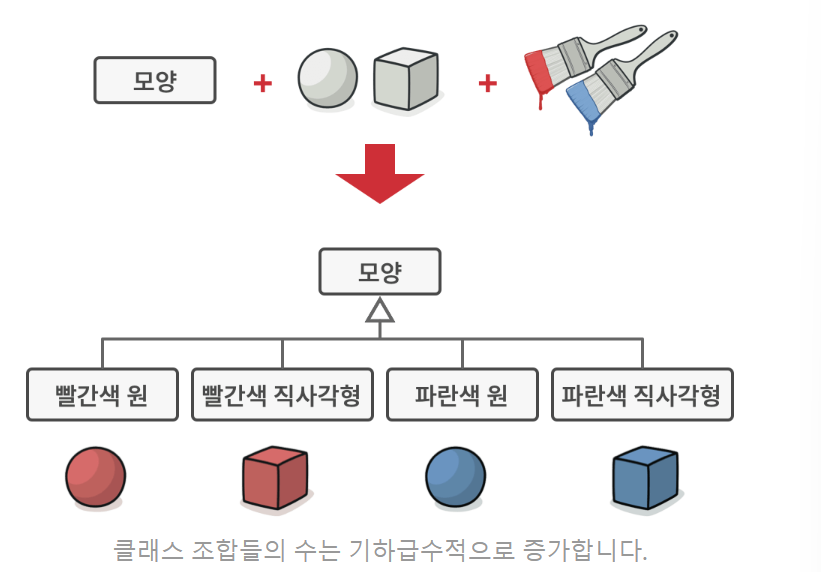
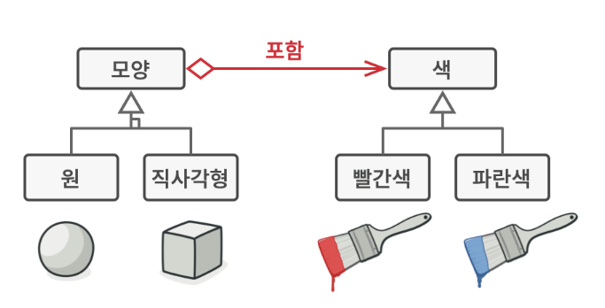
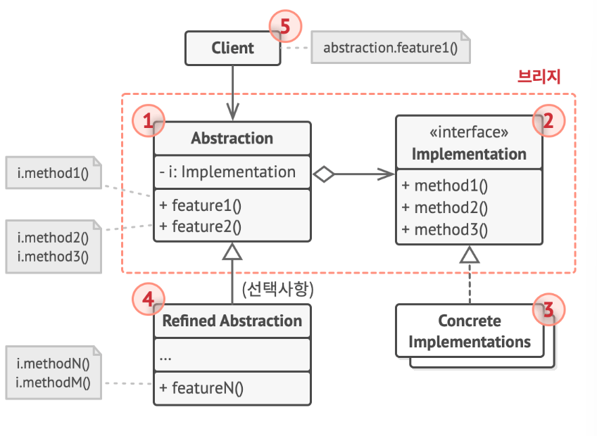

## 브리지 패턴
- 클래스 또는 밀접하게 관련된 클래스들의 집합을 두 개의 개별 계층구조(추상화 및 구현)로 나눈 후 각각 독립적으로 개발할 수 있도록 하는 구조 디자인 패턴
- 클래스 상속과 관련된 매우 일반적인 문제를 해결하기 위한 패턴
- 비즈니스 로직 또는 거대한 클래스를 독립적으로 개발할 수 있는 별도의 클래스 계층구조들로 나눔

  - 위 같은 모양 클래스, 모양의 자식 클래스들, 색상 클래스를 상속하여 클래스들을 조합할 때 클래스가 추가될 수록 조합되는 경우의 수가 기하급수적으로 증가함
  - 조합하는 유형들이 많아질수록 코드는 점점 복잡해지는 문제가 발생함
  - 위 같은 문제를 해결하기 위해 조합 문제를 상속에서 **객체 합성**으로 전환하여 문제를 해결하려고 시도

- 유형 중 하나를 별도의 클래스 계층구조로 추출, 원래 클래스들이 한 클래스 내에서 모든 상태와 행동들을 갖는 대신 새 계층구조의 객체를 참조하도록 함
- 새 유형을 추가할 때 모양 계층 구조를 변경할 필요가 없음

## 추상화와 구현 (`인터페이스와 추상 클래스들을 의미하는 것이 아님`)
- **추상화는** 일부 개체에 대한 상위 수준의 제어 레이어
  - 이 레이어는 자체적으로 실제 작업을 수행해서는 안되며, 작업들을 구현 레이어에 위임
  - 예를 들어 그래픽 사용자 인터페이스는 추상화이며 **구현**은 그래픽 사용자 인터페이스 레이어가 사용자와 상호작용하여 그 결과로 호출하는 **운영체제의 API** 임
- 추상화 객체는 앱의 드러나는 모습을 제어, 연결된 구현 객체에 실제 작업들을 위임
- 서로 다른 구현들은 공통 인터페이스를 따르는 한 상호 호환이 가능하며, 이에 따라 같은 그래픽 사용자 인터페이스는 리눅스와 윈도우에 동시에 작동 가능

## 구조

### 추상화(Abstraction)
- 상위 수준의 제어 논리 제공, 구현 객체에 의존해 실제 하위 수준 작업들을 수행
### 구현(Implementation)
- 모든 구상 구현들에 공통적인 인터페이스를 선언하며, 추상화는 여기에 선언된 메서드들을 통해서만 구현 객체와 소통 가능
- 추상화는 구현과 같은 메서드들을 나열할 수 있지만 보통은 구현이 선언한 다양한 원시 작업들에 의존하는 몇 가지 복잡한 행동들을 선언
### 구상 구현들(Concrete Implementations)
- 플랫폼별 맞춤형 코드 포함
### 정제된 추상화들(Refined Abstraction) - 선택사항
- 제어 논리의 변형들을 제공, 그들은 그들의 부모처럼 일반 구현 인터페이스를 통해 다른 구현들과 작업
### 클라이언트
- 일반적으로 추상화와 작업에만 관심이 있으나 추상화 객체를 구현 객체들 중 하나와 연결하는 것도 클라이언트의 역할임

## 적용 시기
- **어떤 기능의 여러 변형을 가진 모놀리식 클래스를 나누고 정돈하려 할 때 사용**
  - 클래스가 커질 수록 작동 방식을 파악하기가 어려워지고 해당 클래스를 변경하는 데 더더욱 오랜 시간이 소모 
  - 모놀리식 클래스를 여러 클래스 계층구조로 나누고, 각 계층구조의 클래스들을 다른 계층구조들에 있는 클래스들과는 독립적으로 변경
  - 코드의 유지관리를 단순화, 기존 코드 손상 위험 최소화
- **여러 직교 차원에서 클래스를 확장해야할 때 사용**
  - 각 차원에 대해 별도의 클래스 계층구조를 추출
  - 원래 클래스는 모든 작업을 자체적으로 수행하는 대신 추출된 계층구조들에 속한 객체들에 관련 작업들을 위임
- **런타임에 구현을 전환할 수 있어야 할 때에 사용**
  - 추상화 내부의 구현 객체를 바꿀 수 있으며, 필드에 새 값을 할당하기만 하면 됨 (**이 부분이 전략 패턴과 혼동되는 부분**)

## 구현 방법
1. 클래스에서 직교 차원들(예: **추상화/플랫폼, 도메인/인프라, 프론트엔드/백엔드, 인터페이스/구현 등**) 식별
2. 클라이언트가 필요로 하는 작업들로 기초 추상 클래스 정의
3. 모든 플랫폼들에 제공되어야 하는 작업들을 결정, 그 후 추상화에 필요한 작업들을 일반 구현 인터페이스에서 선언
4. 도메인의 모든 플랫폼에 대해 구상 구현 클래스들을 생성하되 이 클래스를 모두가 구현 인터페이스를 따르도록 함
5. 추상화 클래스 내에서 구현 유형에 대한 참조 필드를 추가, 추상화는 대부분 작업들을 위 필드에서 참조되는 구현 객체에 위임
6. 상위 수준 논리의 변형들이 여러 개 있는 경우 기초 추상화 클래스를 확장하여 각 변형에 대해 정제된 추상화들을 만듦
7. 클라이언트 코드는 구현 객체를 추상화의 생성자에 전달하여 이 객체를 그 생성자에 연관 시킴, 그 후에 클라이언트는 구현을 잊어버린 후 추상화 객체와만 작업 가능

## 장점
- 플랫폼 독립적인 클래스들과 앱들을 만들 수 있음
- 클라이언트 코드는 상위 수준의 추상화를 통해 작동하며, 플랫폼 세부 정보에 노출되지 않음
- **"개방/폐쇄 원칙"** 새로운 추상화들과 구현들을 상호 독립적으로 도입
- **"단일 책임 원칙"** 추상화의 상위 수준 놀리와 구현의 플랫폼 세부 정보에 집중 가능

## 단점
- 결합도가 높은 클래스에 패턴을 적용하여 코드를 더 복잡하게 만들 수 있음

