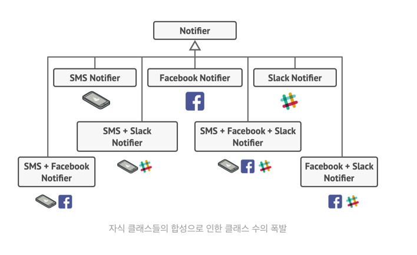
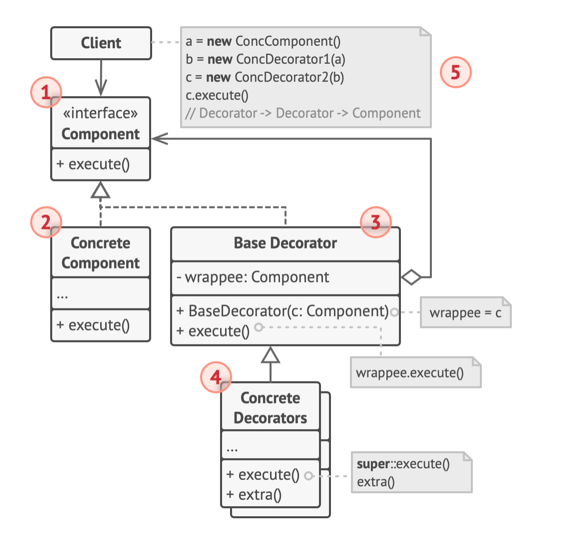

## 데코레이터(Decorator) 패턴
- 객체들을 새로운 행동들을 포함한 특수 래퍼 객체들 내에 넣어서 위 행동들을 해당 객체들에 연결시키는 구조적 디자인 패턴
- 래퍼는 패턴의 주요 아이디어를 명확하게 표현하는 데코레이터 패턴의 별명
  - 래퍼는 일부 대상 객체와 연결할 수 있는 객체
  - 대상 객체와 같은 메서드들의 집합이 포함되어 있으며, 래퍼에 받는 모든 요청을 대상 객체에 위임함
  - 래퍼는 이 요청을 대상에 전달하기 전이나 후에 무언가를 수행하여 결과를 변경할 수 있음
- 래퍼는 래핑된 객체와 같은 인터페이스를 구현, 클라이언트 관점에서 이러한 객체들은 같음
  - 래퍼의 참조 필드가 해당 인터페이스를 따르는 모든 객체를 받도록 하여 여러 래퍼로 객체를 포장해서 모든 래퍼들의 합성된 행동들을 객체에 추가할 수 있음

- 기초 알림자 객체를 클라이언트의 요구사항들과 일치하는 데코레이터들의 집합으로 래핑해야 해서 객체들은 스택으로 구성됨
- 객체 스택의 마지막 데코레이터는 실제로 클라이언트와 작업하는 객체
- 자바의 스트림과 관련된 코드에서 표준으로 사용되고 있음
  - InputStream, OutputStream, Read 와 Writer 의 모든 자식 클래스들은 같은 유형의 객체들을 수락하는 생성자들이 있음

## 문제
- 기존 알림 라이브러리를 Notifier 클래스를 기반으로 하여 Send 메서드만 구현됨
- 클라이언트 코드에서 Notifier 생성자를 통해 이메일을 전달하고, 메시지를 전송하는 방식
- 어느 시점에서 사용자들이 이메일 알림 외에 SMS, Slack 알림을 요구함
  - 이 문제까지는 새 자식 클래스(SMS, Slack)들을 추가하면 됨
- 그러나 중요한 알림 같은 경우, 모든 알림을 다 받길 원하는 요구사항이 추가됨
  - 이 문제를 해결하기 위해 하나의 클래스 내에서 여러 알림 메서드를 합성한 특수 자식 클래스를 만들게 되면 라이브러리 코드 뿐만 아니라 클라이언트 코드도 엄청나게 복잡해짐
  

## 상속의 문제
- 상속은 정적이므로 런타임 때 기존 객체의 행동을 변경할 수 없음, 전체 객체를 다른 자식 클래스에서 생성된 다른 객체로만 바꿀 수 있음
- 자식 클래스는 하나의 부모 클래스만 가질 수 있음, 대부분 언어에서의 상속은 클래스가 동시에 여러 클래스의 행동을 상속하도록 허용하지 않음
> 상속 대신 "집합 관계 또는 합성"을 사용하는 것
- 집합 관계에서는 한 객체가 다른 객체에 대한 참조를 갖고 일부 작업을 위임
  - 집합 관계 : 객체 A는 객체 B를 포함, B는 A없이 생존 가능
  - 상속은 객체 자체가 부모 클래스에서 행동을 상속한 후 해당 작업을 수행할 수 있음
- 합성 : 객체 A는 객체 B로 구성, A는 B의 수명 주기를 관리,B는 A없이 생존할 수 없음
- 도우미 객체를 다른 객체로 쉽게 대체하여 런타임 때 컨테이너의 행동을 변경 가능

## 구조

### 컴포넌트 (Component)
- 래퍼들과 래핑된 객체들 모두에 대한 공통 인터페이스 선언
### 구상 컴포넌트 (Concrete Component)
- 래핑되는 객체들의 클래스, 기본 행동들을 정의 
- 기본 행동들은 데코레이터들이 변경할 수 있음
### 기초 데코레이터 (Base Decorator)
- 래핑된 객체를 참조하기 위한 필드 존재
- 컴포넌트를 생성자로 받아 구상 컴포넌트에서 정의한 기본 행동들을 변경할 수 있는 구조를 가지고 있음
- 필드의 유형은 구상 컴포넌트들과 구상 데코레이터들을 모두 포함할 수 있도록 컴포넌트 인터페이스로 선언되어야 함
- 모든 작업들을 래핑된 객체에 위임
### 구상 데코레이터(Concrete Decorators)
- 컴포넌트들에 동적으로 추가될 수 있는 추가 행동들을 정의
- 그들은 기초 데코레이터의 메서드를 오버라이드하고 해당 행동을 부모 메서드를 호출하기 전이나 후에 실행
### 클라이언트
- 데코레이터들이 컴포넌트 인터페이스를 통해 모든 객체와 작동하는 한 컴포넌트들을 여러 계층의 데코레이터들로 래핑 가능

## 구현 방법
1. 비즈니스 도메인이 여러 선택적 계층으로 감싸진 기본 컴포넌트로 표시될 수 있는지 확인
2. 기본 컴포넌트와 선택적 계층을 양쪽에 공통적인 메서드들이 무엇인지 파악, 그곳에 컴포넌트 인터페이스를 만들고 해당 메서드들을 선언
3. 구상 컴포넌트 클래스를 만든 후 기초 행동들을 정의
4. 기초 데코레이터 클래스 생성
   - 래핑된 객체에 대한 참조를 저장하기 위한 필드 필요 
     - 데코레이터들 및 구상 컴포넌트들과의 연결을 허용하기 위하여 컴포넌트 인터페이스 유형으로 선언해야 함
   - 기초 데코레이터는 모든 작업을 래핑된 객체에 위임해야 함
5. 모든 클래스들이 컴포넌트 인터페이스를 구현하도록 해야 함
6. 기초 데코레이터를 확장하여 구상 데코레이터들을 생성
   - 구상 데코레이터는 항상 부모 메서드 호출 전 또는 후에 행동들을 실행해야 함
   - 부모 메서드는 항상 래핑된 객체에 작업을 위임
7. 데코레이터들을 만들고 이러한 데코레이터들을 클라이언트가 필요로 하는 방식으로 구성하는 일을 반드시 클라이언트 코드가 맡아야 함

## 장점
- 새 자식 클래스를 만들지 않고 객체의 행동 확장 가능
- 런타임에 객체들에서부터 책임들을 추가하거나 제거 가능
- 객체를 여러 데코레이터로 래핑하여 여러 행동들을 합성 가능
- **"단일 책임 원칙"** 다양한 행동들의 여러 변형들을 구현하는 모놀리식 클래스를 여러 개의 작은 클래스들로 나눌 수 있음 

## 단점
- 래퍼들의 스택에서 특정 래퍼를 제거하기 어려움
- 데코레이터의 행동이 데코레이터 스택 내의 순서에 의존하지 않는 방식으로 구현이 어려움
- 계층들의 초기 설정 코드가 복잡할 수 있음