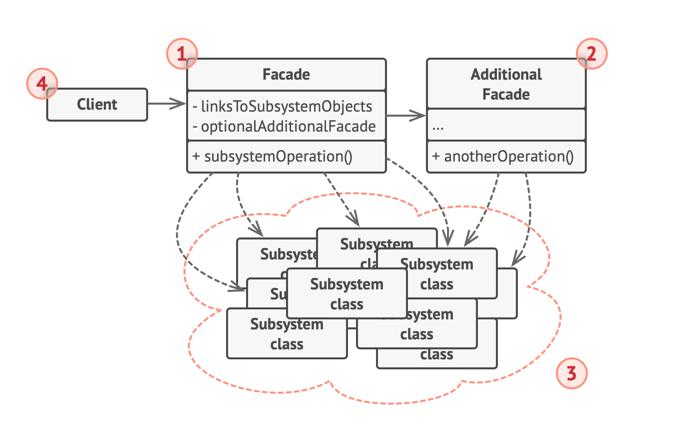

## 퍼사드(Facade) 패턴
- 라이브러리 및 프레임워크, 다른 클래스들의 복잡한 집합에 대한 단순화된 인터페이스를 제공하는 구조적 디자인 패턴
- 정교한 라이브러리나 프레임워크에 광범위한 객체들의 집합으로 코드를 구성할 때, 이러한 객체들을 모두 초기화하고, 종속성 관계들을 추적하고, 올바른 순서로 메서드들을 실행하는 등의 작업을 수행할 때 타사 클래스들의 구현 세부 사항들과 밀접하게 결합하는 문제가 있음
- 복잡한 하위 시스템에 대한 간단한 인터페이스를 제공하는 패턴
  - 하위 시스템과 직접 작업하는 것보다 비교적 제한된 기능성을 제공
  - 클라이언트들이 정말로 중요하게 생각하는 기능들만 제공함
- 앱을 수십 가지의 기능이 있는 정교한 라이브러리와 통합해야 하지만 그 기능의 극히 일부만을 필요로 할 때 편리함

## 실세계 예시
- 전화로 주문하기 위해 매장에 전화를 걸었을 때 전화를 받는 **교환원이 상점의 모든 서비스와 부서에 대한 퍼사드 역할**
- 교환원은 주문 시스템, 지불 게이트웨이 및 다양한 배송 서비스에 대한 간단한 음성 인터페이스를 제공함

## 구조

### 퍼사드(Facade)
- 하위 시스템 기능들의 특정 부분에 편리하게 접근 가능
- 클라이언트의 요청을 어디로 보내야 하는지와 움직이는 모든 부품을 어떻게 작동해야 하는지를 알고 있음

### 추가적인 퍼사드(Additional Facade)
- 클래스를 생성하여 하나의 퍼사드를 관련 없는 기능들로 오염시켜 복잡한 구조로 만드는 것을 방지 가능
- 클라이언트들과 다른 퍼사드들 모두에 사용 가능

### 복잡한 하위 시스템
- 수십 개의 다양한 객체들로 구성
- 이 모든 객체가 의미 있는 작업을 수행하도록 하려면, 하위 시스템의 세부적인 구현 정보를 깊이 있게 살펴야 함
- 예를 들어 올바른 순서로 객체들을 초기화하고 그들에게 적절한 형식의 데이터를 제공하는 등의 작업을 수행해야 함

### 클라이언트
- 하위 시스템 객체들을 직접 호출하는 대신 퍼사드를 사용

## 적용
- **퍼사드 패턴은 복잡한 하위 시스템에 대한 제한적이지만 간단한 인터페이스가 필요할 때 사용**
  - 하위 시스템은 시간이 지날수록 더 복잡해지고, 디자인 패턴들을 적용하더라도 보통은 생성되는 클래스들이 점점 더 많아지게 됨
  - 하위 시스템은 더 유연해지고 더 많은 다양한 상황에서 재사용할 수 있도록 변경될 수 있으나 클라이언트에게 요구하는 설정 및 상용구 코드의 양은 점점 더 많아짐
  - 이 문제를 해결하기 위해 Facade 는 대부분의 클라이언트 요건에 부합하면서 하위 시스템에서 가장 많이 사용되는 기능들을 제공함
- **하위 시스템을 계층들로 구성하려는 경우 사용**
  - 하위 시스템의 각 계층에 대한 진입점을 정의하기 위해 퍼사드 패턴 생성
  - 여러 하위 시스템이 퍼사드 패턴들을 통해서만 통신하도록 함으로써 해당 하위 시스템 간의 결합도를 줄일 수 있음
  > 예시로 비디오 변환 프레임워크는 비디오 또는 오디오 관련의 두 가지 계층으로 나뉠 수 있음
  > 각 계층에 퍼사드를 만든 다음 각 계층의 클래스들이 해당 퍼사드들을 통해 서로 통신하도록 할 수 있음

## 구현방법
1. 기존 하위시스템이 이미 제공하고 있는 것보다 더 간단한 인터페이스를 제공하는 것이 가능한지 확인
   - 인터페이스가 클라이언트 코드를 하위 시스템의 여러 클래스로부터 독립시켜야 제대로 된 구성이라고 볼 수 있음
2. 새 퍼사드 패턴 클래스에서 이 인터페이스를 선언하고 구현, 클라이언트 코드의 호출들을 하위 시스템의 적절한 객체들로 리다이렉션 해야 함 
   - 해당 퍼사드는 클라이언트가 아래 작업을 이미 수행하지 않는 한 하위시스템을 초기화하고 추가 수명 주기를 관리하는 작업의 책임을 담당
3. 모든 클라이언트 코드가 퍼사드 패턴을 통해서만 하위 시스템과 통신하도록 변경
   - 클라이언트 코드는 하위 시스템 코드의 변경 사항들로부터 보호됨 (하위 시스템이 새 버전으로 업그레이드되면 퍼사드의 코드만 수정하면 됨)
4. 퍼사드가 너무 커지면 행동들 일부를 새롭고 정제된 퍼사드 클래스로 추출하는 것을 고려

## 장점
- 복잡한 하위 시스템에서 코드를 별도로 분리할 수 있음

## 단점
- 퍼사드는 앱의 모든 클래스에 결합되어 복잡한 객체가 될 수 있음

