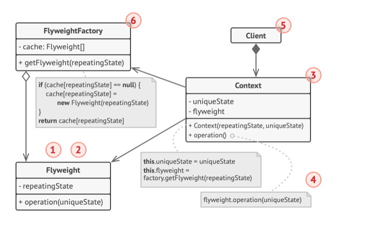

## 플라이웨이트 패턴 
- 각 객체에 모든 데이터를 유지(**RAM 상주**)하는 대신 여러 객체들 간에 공통 부분들을 공유하여 RAM에 더 많은 객체들을 포함할 수 있도록 하는 구조 디자인 패턴
- 여러 객체들이 하나의 공통 객체를 멤버 변수로 가져 공통 객체를 각각 대량으로 생성하게 되면 RAM 사용률이 높아지는 문제가 생김
  - 객체들 마다 각각 다른 상태 값을 갖도록 생성할 수 있지만 특정 필드는 동일한 상수 데이터를 생성함 -> 이러한 상수 데이터를 **고유한 상태**라고 함
    - 고유한 상태의 데이터는 읽을 수만 있고 외부 객체가 변경할 수 없음
    - 종종 다른 객체들에 의해 외부에서 변경되는 객체의 나머지 상태를 **공유한 상태** 라고 함
- 메모리 사용을 줄이기 위해 여러 객체가 공통된 데이터를 공유하도록 하는 디자인 패턴
- 비슷한 객체를 많이 만들면 메모리가 부족해질 수 있는데, 반복되는 데이터(고유한 상태)는 한 번만 저장하고, 각 객체마다 다른 데이터(공유한 상태)는 필요할 때마다 메서드에 전달하는 방식으로 메모리 절약
- 예를 들어, 게임에서 수천 개의 총알(총알 객체)이 화면에 나타난다고 가정했을 때, 모든 총알은 색상(color)과 무늬(sprite)가 같지만 위치(position)만 다름
  - 고유한 상태 : 색상, 스프라이트 
  - 공유한 상태 : 위치
- 플라이웨이트 패턴을 적용하면, 고유한 상태(색상, 스프라이트)는 한 번만 저장하고, 위치는 각 총알이 필요할 때마다 메서드에 전달
- 이렇게 수천 개의 총알 객체를 만들더라도 색상과 스프라이트는 메모리에 한 번만 저장되어 메모리 사용량이 크게 줄어듦
- 고유한 상태는 객체 내부에 저장하고, 공유한 상태는 외부에서 전달함

### 공유한 상태 스토리지
- 공유한 상태는 더 이상 각 객체 내부에 저장하지 않고, 외부에서 관리
- 이 상태는 각 객체마다 다르기 때문에 고유한 상태(플라이웨이트 객체)와 분리해서 별도의 콘텍스트 클래스에 저장
- 컨테이너는 여러 콘텍스트 객체를 배열로 관리, 각 콘텍스트 객체는 플라이웨이트 객체와 자신의 고유한 상태(좌표, 속도 등)을 가지고 있음
- 예시
  - 게임에서 총알이 1000개가 있다고 가정
  - 플라이웨이트 객체 : 색상, 스프라이트 -> 1개만 생성해서 모든 총알이 공유
  - 콘텍스트 객체 : 각 총알의 좌표, 속도 -> 1000개의 콘텍스트 객체가 각각 플라이웨이트 객체를 참조
  - 컨테이너 : Game 클래스가 1000개의 콘텍스트 객체를 배열로 관리

### 플라이웨이트 불변성
- 플라이웨이트 객체가 다른 콘텍스트들에서 사용될 수 있으므로 해당 플라이웨이트 객체의 상태를 변경할 수 없어야 함
  - 생성자 매개변수들을 통해 상태를 한 번만 초기화 해야 함
  - setter 또는 public 필드들을 다른 객체들에 노출해선 안됨

### 플라이웨이트 팩토리
- 다양한 플라이웨이트들에 편리하게 액세스하기 위해 기존 플라이웨이트 객체들의 풀을 관리하는 팩토리 메서드 생성 가능
  - 이 메서드는 클라이언트가 원하는 플라이웨이트의 고유한 상태를 받아들이고 이 상태와 일치하는 기존 플라이웨이트 객체를 찾고 발견되면 반환 
  - 없으면 새 플라이웨이트를 생성하여 풀에 추가 
- 팩토리 메서드는 컨테이너에 위치하는 것이 가장 확실
- 또는 새로운 팩토리 클래스를 생성하여 팩토리 메서드를 정적으로 만들고 실제 플라이웨이트 클래스에 넣을 수 있음

## 구조

1. 패턴 적용 전에 프로그램이 동시에 메모리에 유사한 객체들을 대량으로 보유하는 것과 관련된 RAM 소비 문제가 있는지 확인
2. 플라이웨이트 클래스에는 여러 객체들 간에 공유할 수 있는 원래 객체의 상태 부분이 포함
   - 플라이웨이트 객체는 다양한 콘텍스트에서 사용될 수 있음
   - 플라이웨이트 내부에 저장된 상태를 고유한 상태라고 하며, 메서드에 전달된 상태를 공유한 상태
3. 콘텍스트 클래스는 공유한 상태를 포함, 이 상태는 모든 원본 객체들에서 고유
   - 콘텍스트가 플라이웨이트 객체 중 하나와 쌍을 이루면 원래 객체의 전체 상태를 나타냄
4. 일반적으로 원래 객체의 행동이 플라이웨이트 클래스에 남아 있는데, 이 경우 플라이웨이트의 메서드 호출자는 공유한 상태를 메서드의 매개변수로 전달
   - 반면에 행동이 콘텍스트 클래스로 옮겨진 경우, 플라이웨이트 클래스는 데이터만 저장하는 단순한 객체가 됨
     - 콘텍스트 클래스는 플라이웨이트 객체를 참조해서 필요한 데이터를 가져오고, 자신의 상태(공유한 상태)를 활용해 행동을 수행
5. 클라이언트의 역할과 플라이웨이트 객체의 활용 방식 
   - 클라이언트는 객체가 사용할 공유한 상태를 저장하거나 계산, 이 공유한 상태는 플라이웨이트 객체의 메서드 파라미터로 전달
   - 플라이웨이트는 런타임에 콘텍스트를 받아 행동을 결정하는 템플릿 같은 역할
6. 플라이웨이트 팩토리는 기존 플라이웨이트들의 풀을 관리
   - 클라이언트들은 플라이웨이트들을 직접 만들지 않는 대신 원하는 플라이웨이트의 고유한 상태의 일부를 전달하여 팩토리 호출
   - 팩토리는 이전에 생성된 플라이웨이트들을 검색하여 검색 기준과 일치하는 기존 플라이웨이트를 반환하거나, 없으면 새로 생성
