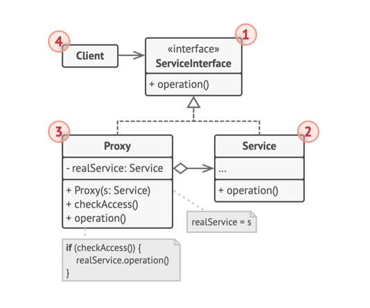

## Proxy 패턴
- 다른 객체에 대한 대체 또는 자리표시자를 제공할 수 있는 구조 디자인 패턴
  - 원래 객체에 대한 접근을 제어, 요청이 원래 객체에 전달되기 전 또는 후에 무언가를 수행할 수 있도록 함
- 시스템 자원 소비가 많은 객체가 있지만 항상 필요한 객체가 아닐 때, 필요할 때만 해당 객체를 만들어서 지연된 초기화를 구현
- 원래 서비스 객체와 같은 인터페이스로 새 프록시 클래스를 생성하여 프록시 객체를 원래 객체의 모든 클라이언트들에 전달하도록 업데이트
  - 요청을 받으면 이 프록시는 실제 서비스 객체를 생성하고 모든 작업을 이 객체에 위임
- 클래스의 메인 로직 이전이나 추가 로직이 필요한 경우 프록시는 해당 클래스를 변경하지 않고 추가 로직을 수행할 수 있도록 함
  - 원래 클래스와 같은 인터페이스를 구현하므로 실제 서비스 객체를 기대하는 모든 클라이언트에 전달될 수 있음

## 구조

### 서비스 인터페이스
- 서비스의 인터페이스 선언, 프록시가 서비스 객체로 위장할 수 있으려면 이 인터페이스를 구현해야 함

### 서비스
- 어떤 유용한 비즈니스 로직을 제공하는 클래스

### 프록시
- 클래스에는 서비스 객체를 가리키는 참조 필드 존재, 프록시가 요청의 처리(초기화 지연, 로깅, 액세스 제어, 캐싱 등)를 완료하면, 그 후 처리된 요청을 서비스 객체에 전달  
- 일반적으로 프록시들은 서비스 객체들의 전체 수명 주기를 관리

### 클라이언트
- 같은 인터페이스를 통해 서비스들 및 프록시들과 함께 작동해야 함
  - 서비스 객체를 기대하는 모든 코드에 프록시를 전달할 수 있음

## 적용
- **지연된 초기화(가상 프록시), 어쩌다 필요한 무거운 서비스 객체가 항상 가동되어 있어 시스템 자원들을 낭비할 때 적용**
  - 앱이 시작할 때 객체를 생성하는 대신, 객체 초기화를 실제로 초기화가 필요한 시점까지 지연 가능
- **접근 제어(보호 프록시), 특정 클라이언트들만 서비스 객체를 사용할 수 있도록 하려는 경우에 사용 가능**
  - 운영체제의 중요한 부분인 객체들이 있고, 클라이언들에서 악의적인 응용 프로그램이 포함된 경우
  - 클라이언트의 자격 증명이 어떤 정해진 기준과 일치하는 경우에만 서비스 객체에 요청 전달
- **원격 서비스의 로컬 실행(원격 프록시), 서비스 객체가 원격 서버에 있는 경우**
  - 프록시는 네트워크를 통해 클라이언트 요청을 전달하여 네트워크와의 작업의 모든 복잡한 세부 사항을 처리
- **요청들의 로깅(로깅 프록시), 서비스 객체에 대한 요청들의 기록을 유지하려는 경우**
  - 프록시는 각 요청을 서비스에 전달하기 전에 로깅할 수 있음
- **요청 결과들의 캐싱(캐싱 프록시), 클라이언트 요청들의 결과들을 캐시하고 이 캐시들의 수명 주기를 관리해야 할 때, 특히 결과들이 상당히 큰 경우에 사용됨**
  - 프록시는 항상 같은 결과를 생성하는 반복 요청들에 대해 캐싱을 구현할 수 있음
  - 프록시는 요청들의 매개변수들을 캐시 키들로 사용할 수 있음
- **스마트 참조, 사용하는 클라이언트들이 없어 거대한 객체를 해제할 수 있어야 할 때 사용됨**
  - 프록시는 서비스 객체 또는 그 결과에 대한 참조를 얻은 클라이언트들을 추적할 수 있음 
  - 떄때로 프록시는 클라인트들을 점검하여 여전히 활성 상태인지 확인 가능
  - 클라이언트 리스트가 비어 있으면 프록시는 해당 서비스 객체를 닫고 그에 해당하는 시스템 자원을 확보 할 수 있음
  - 또한 프록시는 클라이언트가 서비스 객체를 수정했는지도 추적할 수 있으며, 변경되지 않은 객체는 다른 클라이언트들이 재사용할 수 있음

## 구현 방법
1. 서비스 인터페이스를 하나 생성하여 프록시와 서비스 객체 간의 상호 교환 가능하게 변경(이미 존재하면 새로 생성 X)
   - 서비스 클래스에서 인터페이스를 추출하는 것이 항상 가능한 것은 아님, 인터페이스를 사용하려면 모든 클라이언트를 변경해야 하기 때문
   - **대신 프록시를 서비스 클래스의 자식 클래스로 만들 수 있으며**, 이렇게 하면 서비스의 인터페이스를 상속하게 할 수 있음
2. 프록시 클래스 생성, 서비스에 대한 참조를 저장하기 위한 필드 필수
   - 일반적으로 프록시들은 서비스들의 전체 수명 주기를 생성하고 관리
   - 또 드물지만, 클라이언트가 서비스를 프록시의 생성자에 전달하는 방식으로 서비스가 프록시에 전달되기도 함
3. 목적에 따라 프록시 메서드 구현
   - 대부분의 경우 프록시는 일부 작업을 수행한 후에 그 작업을 서비스 객체에 위임해야 함
4. 클라이언트가 프록시를 받을지 실제 서비스를 받을지를 결정하는 생성 메서드를 도입 고려
   - 생성 메서드는 프록시 클래스의 간단한 정책 메서드이거나 완전한 팩토리 메서드일 수 있음
5. 서비스 객체에 대해 지연된 초기화 구현을 고려

## 장점
- 클라이언트들이 알지 못하는 상태에서 서비스 객체를 제어할 수 있음
- 클라이언트들이 신경 쓰지 않을 때 서비스 객체의 수명 주기를 관리할 수 있음
- 프록시는 서비스 객체가 준비되지 않았거나 사용할 수 없는 경우에도 작동
- 개방/폐쇄 원칙.
  - 서비스나 클라이언트들을 변경하지 않고도 새 프록시들을 도입할 수 있음

## 단점
- 새로운 클래스를 많이 도입해야 하므로 코드가 복잡해질 수 있음
- 서비스의 응답이 늦어질 수 있음

